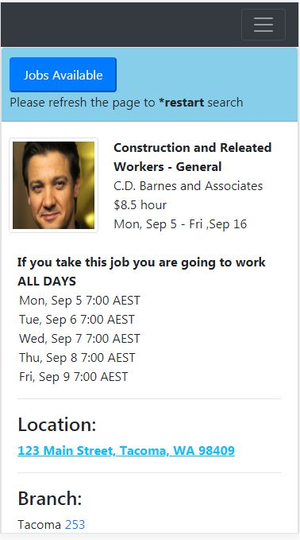

## About the app
#Angular 6 based B2B App to match on-demand workers with employers who are staffing firm customers . This is the production build  of the application. The  source codecan be found at 
`https://github.com/deepeshdesigns/swjobs-sourcecode`

This project was generated with [Angular CLI](https://github.com/angular/angular-cli) version 6.0.8.

This app can be used as an interface between contract job seekers in labour market and companies look for temporary hires. 

The front experience is a mobile view of how a particular labour, who is not very tech savvy, would get to see the details of a particular job when he picks a job from list of available jobs

The application mimics calling a backend API containing available jobs based on search criteria such as :
a. Daily rates
b. Start date
c. End dates

Currently the front end only shares job search result page for a particular job a labour want to apply for / shows interest in but can be extrapolated with a listing page with list of jobs picked from the backend API

## Running version of the app
You can experience the app at `https://deepeshdesigns.github.io/swjobs/`

## Frontend of the app

## Production server
Simply copy the build in root folder of your webserver and the app would work 

